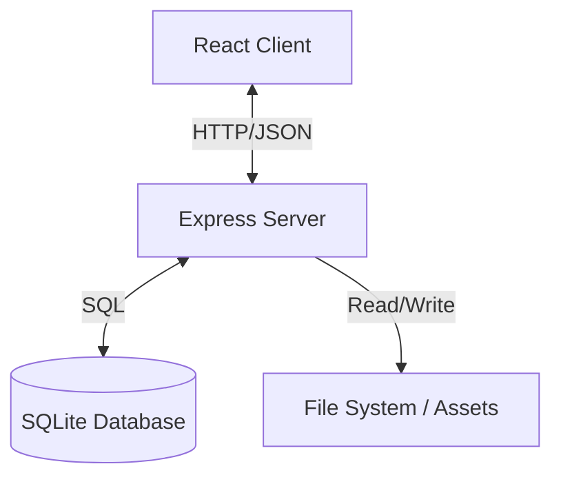

# 🏛️ Architecture & System Context

## High-Level Diagram

## Directory Structure
* **`src/`**: Main source code (Frontend React, Vite).
* **`server/`**: Backend source code (Express API).
* **`rag/`**: Contains all AI Context (RAG documentation).
* **`public/`**: Static assets.
* **`data/`**: Contains SQLite database file and persistent data.

## System Context
The **Shortcut Manager** is a web-based application designed to manage and organize shortcuts. It consists of a Single Page Application (SPA) frontend and a RESTful backend server with a SQLite database.

## Key Data Flows
1.  **Frontend Initialization**: React app loads, fetches configuration/shortcuts from `GET /api/...` endpoints.
2.  **Shortcut Management**: Users create/update shortcuts -> `POST/PUT /api/shortcuts` -> Server validates -> Updates SQLite DB.
3.  **Localization**: Frontend loads specific locale JSON from `src/locales/` based on user selection.
4.  **Scheduled Tasks**: `node-cron` handles background jobs.
