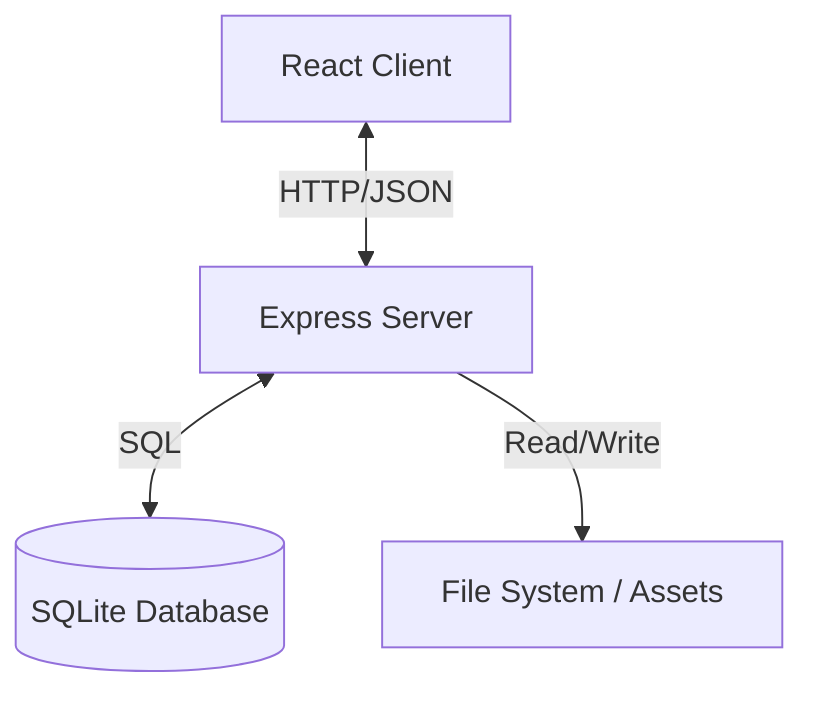

# Architecture

## System Context
The **Shortcut Manager** is a web-based application designed to manage and organize shortcuts. It consists of a Single Page Application (SPA) frontend and a RESTful backend server with a SQLite database.

## High-Level Diagram

## Directory Structure
- **`src/`**: Frontend source code (React, Vite).
    - `components/`: UI Components.
    - `contexts/`: React Contexts (e.g., LanguageContext).
    - `locales/`: i18n JSON files.
- **`server/`**: Backend source code.
    - `index.js`: Server entry point.
    - `routes.js`: API route definitions.
    - `database.js`: Database interaction logic (better-sqlite3).
- **`public/`**: Static assets.
- **`data/`**: Likely location for the SQLite database file and persistent data.
- **`rag/`**: RAG context and documentation (This directory).

## Key Data Flows
1.  **Frontend Initialization**: React app loads, fetches configuration/shortcuts from `GET /api/...` endpoints.
2.  **Shortcut Management**: Users create/update shortcuts -> `POST/PUT /api/shortcuts` -> Server validates -> Updates SQLite DB.
3.  **Localization**: Frontend loads specific locale JSON from `src/locales/` based on user selection.
4.  **Scheduled Tasks**: `node-cron` (if used in `server/`) handles background jobs.
